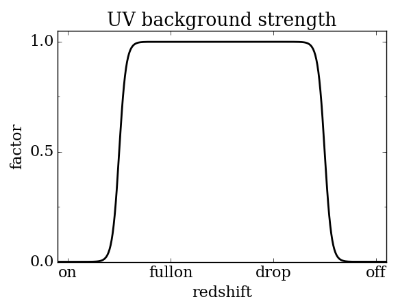

.. _parameters:

Parameters and Data Files
=========================

Parameters
----------

For all on/off integer flags, 0 is off and 1 is on.

.. c:var:: int use_grackle

   Flag to activate the grackle machinery.  Default: 0.

.. c:var:: int with_radiative_cooling

   Flag to include radiative cooling and actually update the thermal
   energy during the chemistry solver.  If off, the chemistry species
   will still be updated.  The most common reason to set this to off
   is to iterate the chemistry network to an equilibrium state.
   Default: 1.

.. c:var:: int primordial_chemistry

   Flag to control which primordial chemistry network is used.
   Default: 0.

    - 0: no chemistry network.  Radiative cooling for primordial
      species is solved by interpolating from lookup tables
      calculated with Cloudy.
    - 1: 6-species atomic H and He.  Active species: H, H\ :sup:`+`,
      He, He\ :sup:`+`, \ :sup:`++`, e\ :sup:`-`.
    - 2: 9-species network including atomic species above and species
      for molecular hydrogen formation.  This network includes
      formation from the H\ :sup:`-` and H\ :sub:`2`\ :sup:`+`
      channels, three-body formation (H+H+H and H+H+H\ :sub:`2`),
      H\ :sub:`2` rotational transitions, chemical heating, and
      collision-induced emission (optional).  Active species: above +
      H\ :sup:`-`, H\ :sub:`2`, H\ :sub:`2`\ :sup:`+`.
    - 3: 12-species network include all above plus HD rotation cooling.
      Active species: above + D, D\ :sup:`+`, HD.

.. note:: In order to make use of the non-equilibrium chemistry
   network (:c:data:`primordial_chemistry` options 1-3), you must add
   and advect baryon fields for each of the species used by that
   particular option.

.. c:var:: int h2_on_dust

   Flag to enable H\ :sub:`2` formation on dust grains, dust cooling, and
   dust-gas heat transfer follow `Omukai (2000)
   <http://adsabs.harvard.edu/abs/2000ApJ...534..809O>`_.  This assumes
   that the dust to gas ratio scales with the metallicity.  Default: 0.

.. c:var:: int metal_cooling

   Flag to enable metal cooling using the Cloudy tables.  If enabled, the
   cooling table to be used must be specified with the
   :c:data:`grackle_data_file` parameter.  Default: 0.

.. note:: In order to use the metal cooling, you must add and advect a
   metal density field.

.. c:var:: int cmb_temperature_floor

   Flag to enable an effective CMB temperature floor.  This is implemented
   by subtracting the value of the cooling rate at T\ :sub:`CMB` from the
   total cooling rate.  Default: 1.

.. c:var:: int UVbackground

   Flag to enable a UV background.  If enabled, the cooling table to be
   used must be specified with the :c:data:`grackle_data_file` parameter.
   Default: 0.

.. c:var:: float UVbackground_redshift_on

   Used in combination with :c:data:`UVbackground_redshift_fullon`,
   :c:data:`UVbackground_redshift_drop`, and
   :c:data:`UVbackground_redshift_off` to set an attenuation factor for the
   photo-heating and photo-ionization rates of the UV background model.
   See the figure below for an illustration its behavior.  If not set,
   this parameter will be set to the highest redshift of the UV background
   data being used.

.. c:var:: float UVbackground_redshift_fullon

   Used in combination with :c:data:`UVbackground_redshift_on`,
   :c:data:`UVbackground_redshift_drop`, and
   :c:data:`UVbackground_redshift_off` to set an attenuation factor for the
   photo-heating and photo-ionization rates of the UV background model.
   See the figure below for an illustration its behavior.  If not set,
   this parameter will be set to the highest redshift of the UV background
   data being used.

.. c:var:: float UVbackground_redshift_drop

   Used in combination with :c:data:`UVbackground_redshift_on`,
   :c:data:`UVbackground_redshift_fullon`, and
   :c:data:`UVbackground_redshift_off` to set an attenuation factor for the
   photo-heating and photo-ionization rates of the UV background model.
   See the figure below for an illustration its behavior.  If not set,
   this parameter will be set to the lowest redshift of the UV background
   data being used.

.. c:var:: float UVbackground_redshift_off

   Used in combination with :c:data:`UVbackground_redshift_on`,
   :c:data:`UVbackground_redshift_fullon`, and
   :c:data:`UVbackground_redshift_drop` to set an attenuation factor for the
   photo-heating and photo-ionization rates of the UV background model.
   See the figure below for an illustration its behavior.  If not set,
   this parameter will be set to the lowest redshift of the UV background
   data being used.

.. c:var:: char* grackle_data_file

   Path to the data file containing the metal cooling and UV background
   tables.  Default: "".

.. c:var:: float Gamma

   The ratio of specific heats for an ideal gas.  A direct calculation
   for the molecular component is used if :c:data:`primordial_chemistry`
   > 1.  Default:  5/3.

.. c:var:: int three_body_rate

   Flag to control which three-body H\ :sub:`2` formation rate is used.

    - 0: `Abel, Bryan & Norman (2002)
      <http://adsabs.harvard.edu/abs/2002Sci...295...93A>`_

    - 1: `Palla, Salpeter & Stahler (1983)
      <http://adsabs.harvard.edu/abs/1983ApJ...271..632P>`_

    - 2: `Cohen & Westberg (1983)
      <http://adsabs.harvard.edu/abs/1983JPCRD..12..531C>`_

    - 3: `Flower & Harris (2007)
      <http://adsabs.harvard.edu/abs/2007MNRAS.377..705F>`_

    - 4: `Glover (2008)
      <http://adsabs.harvard.edu/abs/2008AIPC..990...25G>`_

    - 5: `Forrey (2013)
      <http://adsabs.harvard.edu/abs/2013ApJ...773L..25F>`_.

   The first five options are discussed in `Turk et. al. (2011)
   <http://adsabs.harvard.edu/abs/2011ApJ...726...55T>`_.  Default: 0.

.. c:var:: int cie_cooling

   Flag to enable H\ :sub:`2` collision-induced emission cooling from
   `Ripamonti & Abel (2004)
   <http://adsabs.harvard.edu/abs/2004MNRAS.348.1019R>`_.  Default: 0.

.. c:var:: int h2_optical_depth_approximation

   Flag to enable H\ :sub:`2` cooling attenuation from `Ripamonti &
   Abel (2004) <http://adsabs.harvard.edu/abs/2004MNRAS.348.1019R>`_.
   Default: 0.

.. c:var:: int photoelectric_heating

   Flag to enable a spatially uniform heating term approximating
   photo-electric heating from dust from `Tasker & Bryan (2008)
   <http://adsabs.harvard.edu/abs/2008ApJ...673..810T>`_.  Default: 0.

.. c:var:: int photoelectric_heating_rate

   If :c:data:`photoelectric_heating` enabled, the heating rate in
   units of erg cm\ :sup:`-3` s\ :sup:`-1`.  Default: 8.5e-26.

.. c:var:: int Compton_xray_heating

   Flag to enable Compton heating from an X-ray background following
   `Madau & Efstathiou (1999)
   <http://adsabs.harvard.edu/abs/1999ApJ...517L...9M>`_.  Default: 0.

.. c:var:: float LWbackground_intensity

   Intensity of a constant Lyman-Werner H\ :sub:`2` photo-dissociating
   radiation field in units of 10\ :sup:`-21` erg s\ :sup:`-1` cm\
   :sup:`-2` Hz\ :sup:`-1` sr\ :sup:`-1`.  Default: 0.

.. c:var:: int LWbackground_sawtooth_suppression

   Flag to enable suppression of Lyman-Werner flux due to Lyman-series
   absorption (giving a sawtooth pattern), taken from `Haiman & Abel,
   & Rees (2000) <http://adsabs.harvard.edu/abs/2000ApJ...534...11H>`_.
   Default: 0.

.. c:var:: int use_volumetric_heating_rate

   Flag to signal that an array of volumetric heating rates is being
   provided in the :c:data:`volumetric_heating_rate` field of the
   :c:data:`grackle_field_data` struct.  Default: 0.

.. c:var:: int use_specific_heating_rate

   Flag to signal that an array of specific heating rates is being
   provided in the :c:data:`specific_heating_rate` field of the
   :c:data:`grackle_field_data` struct.  Default: 0.

.. c:var:: use_radiative_transfer

   Flag to signal that arrays of ionization and heating rates from
   radiative transfer solutions are being provided. Only
   available if :c:data:`primordial_chemistry` is greater than 0. HI, HeI,
   and HeII ionization arrays are provided in :c:data:`RT_HI_ionization_rate`,
   :c:data:`RT_HeI_ionization_rate`, and :c:data:`RT_HeII_ionization_rate`
   fields, respectively, of the :c:data:`grackle_field_data` struct.
   Associated heating rate is provided in the :c:data:`RT_heating_rate`
   field, and H2 photodissociation rate can also be provided in the
   :c:data:`RT_H2_dissociation_rate` field when
   :c:data:`primordial_chemistry` is set to either 2 or 3. Default: 0.

.. c:var:: radiative_transfer_coupled_rate_solver

   Flag that must be enabled to couple the passed radiative transfer
   fields to the chemistry solver. Default: 0.

.. c:var:: radiative_transfer_intermediate_step

   Flag to enable intermediate stepping in applying radiative transfer
   fields to chemistry solver. Default: 0.

.. c:var:: radiative_transfer_hydrogen_only

   Flag to only use hydrogen ionization and heating rates from the 
   radiative transfer solutions. Default: 0.

.. c:var:: H2_self_shielding

   Switch to enable approximate H2 self-shielding from both the UV
   background dissociation rate and the H2 dissociation rate 
   given by :c:data:`RT_H2_dissociation_rate` (if present). This
   is a Sobolev-like, spherically averaged method from
   `Wolcott-Green et. al. 2011 <http://adsabs.harvard.edu/abs/2011MNRAS.418..838W>`_
   and is only valid for Cartesian grid codes in 3D.
   Default: 0.

.. c:var:: self_shielding_method

   Switch to enable approximate self-shielding from the UV background.
   All three of the below methods incorporate Eq. 13 and 14 from 
   `Rahmati et. al. 2013 <http://adsabs.harvard.edu/abs/2013MNRAS.430.2427R>`_.
   These equations involve using the spectrum averaged photoabsorption cross
   for the given species (HI or HeI). These redshift dependent values are
   pre-computed for the HM2012 and FG2011 UV backgrounds and included in
   their respective cooling data tables. Care is advised in using any of
   these methods.  Default: 0.

     - 0: No self shielding. Elements are optically thin to the UV background.
     - 1: Approximate self-shielding in HI only. HeI and HeII are left 
          as optically thin.
     - 2: Approximate self-shielding in both HI and HeI. HeII remains
          optically thin.
     - 3: Approximate self-shielding in both HI and HeI, but ignoring
          HeII ionization and heating from the UV background entirely (setting
          HeII rates to zero). 

   These methods only work in conjunction with using updated Cloudy
   cooling tables, denoted with "_shielding". These tables properly account
   for the decrease in metal line cooling rates in self-shielded regions,
   which can be significant. 

.. c:var:: int omp_nthreads

   Sets the number of OpenMP threads.  If not set, this will be set to
   the maximum number of threads possible, as determined by the system
   or as configured by setting the ``OMP_NUM_THREADS`` environment
   variable.  Note, Grackle must be compiled with OpenMP support
   enabled.  See :ref:`openmp`.

Data Files
----------

All data files are located in the **input** directory in the source.

The first three files contain the heating and cooling rates for both
primordial and metal species as well as the UV background photo-heating
and photo-ionization rates.  For all three files, the valid density and
temperature range is given below.  Extrapolation is performed when
outside of the data range.  The metal cooling rates are stored for
solar metallicity and scaled linearly with the metallicity of the gas.

Valid range:

 - number density: -10 < log\ :sub:`10` (n\ :sub:`H` / cm\ :sup:`-3`) < 4

 - temperature: the temperature range is 1 < log\ :sub:`10` (T / K) < 9.

Data files:

 - **CloudyData_noUVB.h5** - cooling rates for collisional ionization
   equilibrium.

 - **CloudyData_UVB=FG2011.h5** - heating and cooling rates and UV
   background rates from the work of `Faucher-Giguere et. al. (2009)
   <http://adsabs.harvard.edu/abs/2009ApJ...703.1416F>`_, updated in 2011.
   The maxmimum redshift is 10.6.  Above that, collisional ionization
   equilibrium is assumed.

 - **CloudyData_UVB=HM2012.h5** - heating and cooling rates and UV
   background rates from the work of `Haardt & Madau (2012)
   <http://adsabs.harvard.edu/abs/2012ApJ...746..125H>`_.  The maximum
   redshift is 15.13.  Above that, collisional ionization equilibrium is
   assumed.

To use the self-shielding approximation (see ``self_shielding_method``),
one must properly account for the change in metal line cooling rates in
self-shielded regions. Using the optically thin tables described above can
result in an order of magnitude overestimation in the net cooling rate at
certain densities. We have re-computed these tables by constructing
Jeans-length depth models in Cloudy at each density - temperature pair, 
tabulating the cooling and heating rates from the core of each of these
clouds. These models enforce a maximum depth of 100 pc.
In addition, these tables contain the spectrum averaged absorption
cross sections needed for the Rahmati et. al. 2013 self-shielding 
approximations. Currently only the HM2012 table has been recomputed. 

 - **CloudyData_UVB=HM2012_shielded.h5** - updated heating and cooling
   rates with the HM2012 UV background, accounting for self-shielding.

The final file includes only metal cooling rates under collisional
ionization equilibrium, i.e., no incident radiation field.  This table
extends to higher densities and also varies in metallicity rather than
scaling proportional to the solar value.  This captures the
thermalization of metal coolants occuring at high densities, making this
table more appropriate for simulations of collapsing gas-clouds.

Valid range:

 - number density: -6 < log\ :sub:`10` (n\ :sub:`H` / cm\ :sup:`-3`) < 12

 - metallicity: -6 < log\ :sub:`10` (Z / Z\ :sub:`sun`) < 1

 - temperature: the temperature range is 1 < log\ :sub:`10` (T / K) < 8.

Data file:

 - **cloudy_metals_2008_3D.h5** - collisional ionization equilibrium,
   metal cooling rates only.
