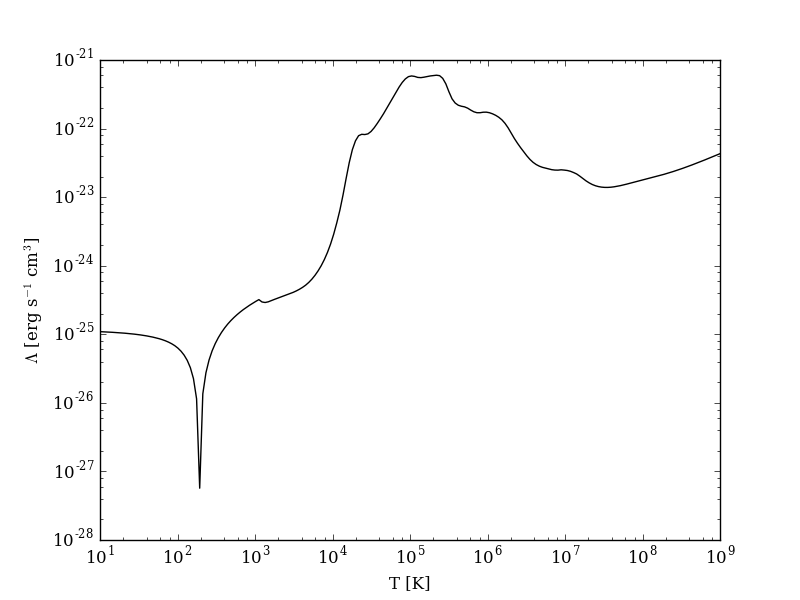
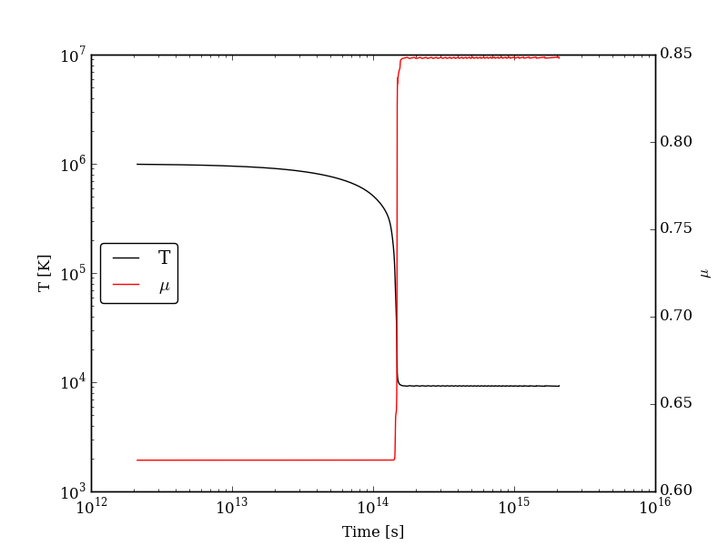
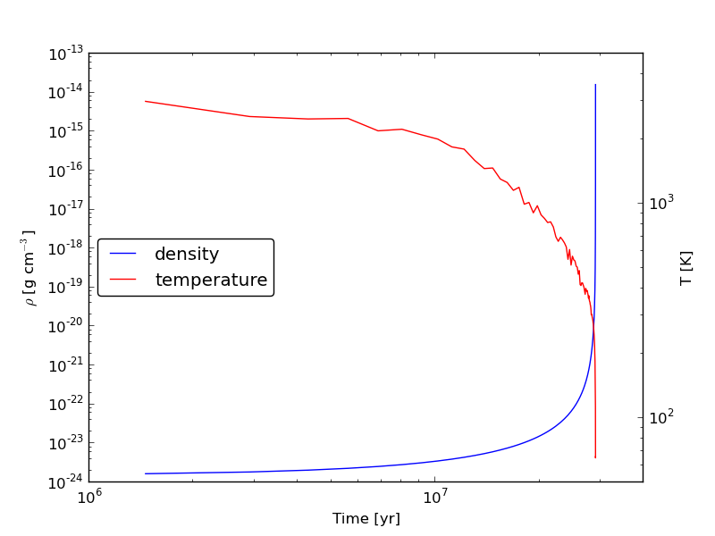

.. _python:

Pygrackle: Running Grackle in Python
====================================

Grackle comes with a Python interface, called Pygrackle, which provides
access to all of Grackle's functionality.  Pygrackle requires the following
Python packages:

 - `Cython <http://www.cython.org/>`__

 - flake8 (only required for the test suite)

 - `matplotlib <http://matplotlib.org/>`__

 - `NumPy <http://www.numpy.org/>`__

 - py.test (only required for the test suite)

 - `yt <http://yt-project.org/>`__

The easiest thing to do is follow the instructions for installing yt,
which will provide you with Cython, matplotlib, and NumPy.  Flake8 and
py.test can then be installed via pip.

Installing Pygrackle
--------------------

Once the Grackle library has been built and the above dependencies have been
installed, Pygrackle can be installed by moving into the **src/python**
directory and running ``python setup.py install``.

.. highlight:: none

::

    ~/grackle $ cd src/python
    ~/grackle/src/python $ python setup.py install

.. note:: Pygrackle can only be run when Grackle is compiled without OpenMP.
   See :ref:`openmp`.

Running the Example Scripts
---------------------------

A number of example scripts are available in the **src/python/examples**
directory.  These scripts provide examples of ways that Grackle can be
used in simplified models, such as solving the temperature evolution of
a parcel of gas at constant density or in a free-fall model.  Each example
will produce a figure as well as a dataset that can be loaded and analyzed
with `yt <http://yt-project.org/>`__.

Cooling Rate Figure Example
+++++++++++++++++++++++++++

This sets up a one-dimensional grid at a constant density with 
logarithmically spaced temperatures from 10 K to 10\ :sup:`9` K.  Radiative cooling 
is disabled and the chemistry solver is iterated until the species fractions 
have converged.  The cooling time is then calculated and used to compute the cooling 
rate.

.. highlight:: none

::

    python cooling_rate.py

After the script runs, and hdf5 file will be created with a similar name.  This
can be loaded in with yt.

.. code-block:: python

   >>> import yt
   >>> ds = yt.load("cooling_rate.h5")
   >>> print ds.data["temperature"]
   [  1.00000000e+01   1.09698580e+01   1.20337784e+01   1.32008840e+01, ...,
      7.57525026e+08   8.30994195e+08   9.11588830e+08   1.00000000e+09] K
   >>> print ds.data["cooling_rate"]
   [  1.09233398e-25   1.08692516e-25   1.08117583e-25   1.07505345e-25, ...,
      3.77902570e-23   3.94523273e-23   4.12003667e-23   4.30376998e-23] cm**3*erg/s

Cooling Cell Example
++++++++++++++++++++

This sets up a single grid cell with an initial density and temperature and solves 
the chemistry and cooling for a given amount of time.  The resulting dataset gives
the values of the densities, temperatures, and mean molecular weights for all times.

.. highlight:: none

::

    python cooling_cell.py

.. code-block:: python

   >>> import yt
   >>> ds = yt.load("cooling_cell.h5")
   >>> print ds.data["time"].to("Myr")
   YTArray([  0.00000000e+00,   6.74660169e-02,   1.34932034e-01, ...,
            9.98497051e+01,   9.99171711e+01,   9.99846371e+01]) Myr
   >>> print ds.data["temperature"]
   YTArray([ 990014.56406726,  980007.32720091,  969992.99066987, ...,
             9263.81515866,    9263.81515824,    9263.81515865]) K

Free-Fall Collapse Example
++++++++++++++++++++++++++

This sets up a single grid cell with an initial number density of 1 cm\ :sup:`-3`.  
The density increases with time following a free-fall collapse model.  As the density 
increases, thermal energy is added to model heating via adiabatic compression.
This can be useful for testing chemistry networks over a large range in density.

.. highlight:: none

::

    python freefall.py

The resulting dataset can be analyzed similarly as above.

.. code-block:: python

   >>> import yt
   >>> ds = yt.load("freefall.h5")
   >>> print ds.data["time"].to("Myr")
   [   0.            0.45900816    0.91572127 ...,  219.90360841  219.90360855
     219.9036087 ] Myr
   >>> print ds.data["density"]
   [  1.67373522e-25   1.69059895e-25   1.70763258e-25 ...,   1.65068531e-12
      1.66121253e-12   1.67178981e-12] g/cm**3
   >>> print ds.data["temperature"]
   [   99.94958248   100.61345564   101.28160228 ...,  1728.89321898
     1729.32604568  1729.75744287] K

Simulation Dataset Example
++++++++++++++++++++++++++

This provides an example of using the grackle library for calculating chemistry and 
cooling quantities for a pre-existing simulation dataset.  To run this example, you 
must also download the *IsolatedGalaxy* dataset from the `yt sample data page
<http://yt-project.org/data/>`_.

.. highlight:: none

::

    python run_from_yt.py
